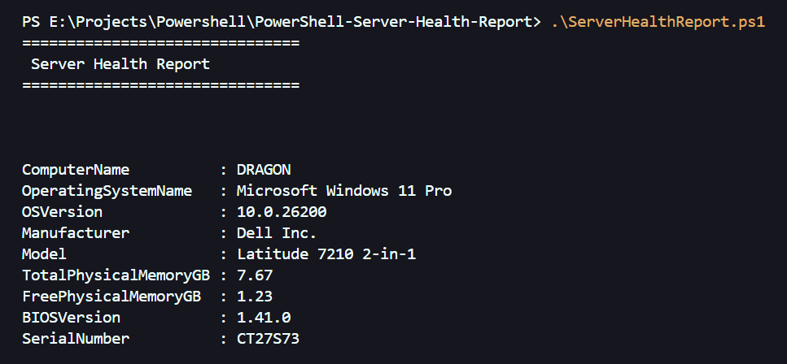

# PowerShell Server Health Report

A production-style PowerShell health check and inventory reporting tool for System Administrators and Azure Administrators. This project demonstrates practical use of CIM/WMI queries, structured output objects, and error handling in a portfolio-ready format.

## Project Overview

**PowerShell Server Health Report** collects key system, hardware, and BIOS details from a local Windows computer and presents them in a clear, readable report. Version 1.0 focuses on core inventory and health metrics that administrators routinely need during troubleshooting, documentation, and server audits.

## Features

- Collects computer name, operating system, and version
- Reports manufacturer, model, and serial number
- Displays total and free physical memory in GB
- Retrieves BIOS version information
- Uses structured PowerShell objects for output
- Includes basic error handling with `try/catch` blocks
- Organized into logical, commented sections for easy learning

## Technologies Used

- PowerShell
- WMI / CIM
- Git
- GitHub

## Skills Demonstrated

- System Inventory
- Windows Administration
- Hardware Information Collection
- PowerShell Scripting
- Documentation
- Version Control

## Requirements

- Windows PowerShell 5.1 or PowerShell 7+
- Windows Server or Windows client with CIM/WMI access
- Local administrator rights are not required for basic inventory queries

## How to Run

1. Clone or download this repository.
2. Open PowerShell and navigate to the project folder:

   ```powershell
   cd PowerShell-Server-Health-Report
   ```

3. Run the script:

   ```powershell
   .\ServerHealthReport.ps1
   ```

4. Review the formatted report displayed in the console.

## Sample Output



```
===============================
 Server Health Report
===============================

ComputerName          : DC01
OperatingSystemName   : Microsoft Windows Server 2022 Standard
OSVersion             : 10.0.20348
Manufacturer          : Dell Inc.
Model                 : PowerEdge R740
TotalPhysicalMemoryGB : 32
FreePhysicalMemoryGB  : 18.45
BIOSVersion           : 2.15.0
SerialNumber          : ABCD1234
```

See [docs/sample-output.txt](docs/sample-output.txt) for a full sample report.

## Future Enhancements

Planned improvements are tracked in the roadmap below. Each version adds practical administrator-focused capabilities while keeping the project approachable for learners.

## Roadmap

### Version 1.1

- Disk Usage Reporting

### Version 1.2

- Top Processes by Memory Usage

### Version 1.3

- Running Services Report

### Version 1.4

- Export to CSV

### Version 1.5

- Export to HTML

### Version 2.0

- Multi-Server Reporting

### Version 3.0

- Azure VM Health Reporting

## License

This project is provided for learning and portfolio use. Feel free to fork, extend, and adapt it for your environment.
